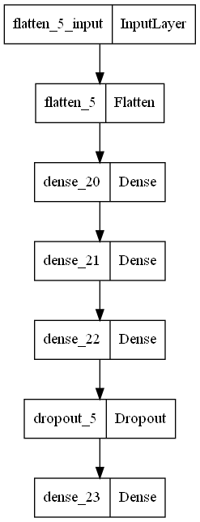

# Estimation of the Mean Function of Functional Data via Deep Neural Networks
------------------------------------------------

# Data definition
- There are 69 images slices contained in a 3D data cube.
- We use one slice from a given cube.
- When combining with other slices from other images we need to make sure that we select the slice from the same position inside the cube.
- Each image slice is a 95x79 matrix.
- Each row of the matrix is the output vector which needs to be predicted. These are the individual pixels in the image.
- To predict the output we need to generate the features which are the coordinates of each pixel in the output vector.
- The coordinates need to be normalized to 1 so for each coordinate needs to be divided by the L_0 norm of the vector.
    - Example: for the first pixel the coordinates will be (1/95, 1/79) and for the last pixel the coordinates will be (1/95, 79/79)
-------------------------------------------------------

# Model input and output
## Input: a set of coordinates e.g. (1/95, 1/79)

### X:
- Get all the first coordinates as first column of the input matrix
- Get all the second coordinates as the second column of the input matrix
----------------------------------------------------------
## Output: predicted value for the pixel at that coordinate.

### Y:
- Take the matrix that contains the actual pixels for each image (this is the desired output) and ravel the array to get it into a single array of 95*79 elements each corresponding to the pixel value that needs to be predicted.
    - example: for an image with dimensions 95x79 - the total number of coordinate sets should be 95*79
    - the number of coordinates should be exactly the same as the number of pixels in the image - this will give a 1:1 correspondence between coordinates and pixels
    - even though as the image changes the pixels in the image change - the coordinates will remain the same for each pixel.
-------------------------------------------------------------
# Model
## Deep Neural Network with 2 layers
### Model Architecture  
</img>

### Current Model Hyperparameters  
- Layers: 2
- Neurons per layer: 1000
- Loss Function: Huber
- Number of Epochs: 1000
- Batch Size: 10
- Dropout rate: 0.25
- Activation layer 1: ReLU
- Activation layer 2: ReLU
- Optimizer: SGD - gradient descent

### Desired Model Hyperparameters - ADNI PET Analysis
- Layers: 3
- Neurons per layer: 1000
- Loss Function: Euclidean
- Number of Epochs: 300 or 500
- Batch Size: 2 to 8
- Sparsity: L_1 10^-7
- Activation layer 1: ReLU
- Activation layer 2: ReLU
- Activation layer 2: ReLU
- Optimizer: Adam
- Image Dimensions: 79x95 pixels

TODO:
- Weights to be constrained between (-1, 1)
- Dropout after each layer - 0.4 or 0.5
- Average pixel values for a crtain subject given the same slice
- Either use L1 regularization or Dropout, but don't use them together.

For MSE:
- L1

For Huber:
- Dropout

### Objective
- Recover the image with higher dimensionality
  - 225x225 pixels
